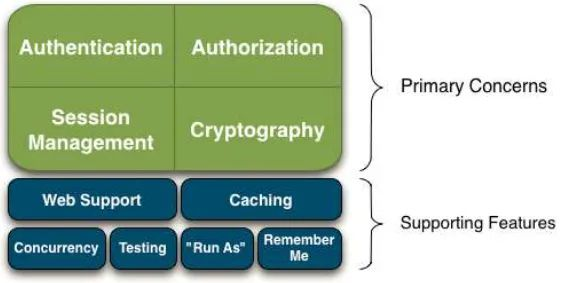
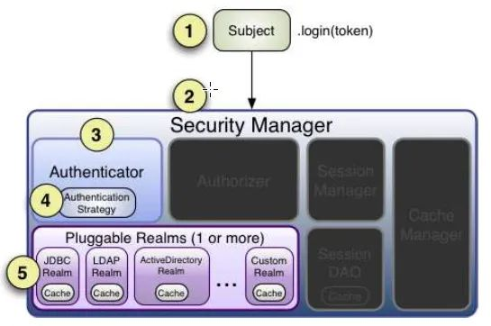

# Shiro 学习

####  Shiro简介



> Apache Shiro是一个开源安全框架，提供身份验证、授权、密码学和会话管理。Shiro框架具有直观、易用等特性，同时也能提供健壮的安全性，虽然它的功能不如SpringSecurity那么强大，但是在普通的项目中也够用了。


#### Shiro 可以做的事

> 1. 验证用户来核实他们的身份
> 2. 对用户执行访问控制，如：判断用户是否被分配了一个确定的安全角色；判断用户是否被允许做某事
> 3. 在任何环境下使用Session API，即使没有Web容器
> 4. 在身份验证，访问控制期间或在会话的生命周期，对事件作出反应
> 5. 聚集一个或多个用户安全数据的数据源，并作为一个单一的复合用户“视图”
> 6. 单点登录（SSO）功能
> 7. 为没有关联到登录的用户启用"Remember Me"服务


#### Shiro中有四大基石——身份验证，授权，会话管理和加密

- Authentication：有时也简称为“登录”，这是一个证明用户是谁的行为。

- Authorization：访问控制的过程，也就是决定“谁”去访问“什么”。
- Session Management：管理用户特定的会话，即使在非Web 或EJB 应用程序。
- Cryptography：通过使用加密算法保持数据安全同时易于使用。


#### Shiro 登录流程

​		

​	参照此图，我们的登录一共要经过如下几个步骤：

>  应用程序代码调用Subject.login方法，传递创建好的包含终端用户的Principals(身份)和Credentials(凭证)的AuthenticationToken实例(即上文例子中的UsernamePasswordToken)。


> Subject实例，通常是DelegatingSubject（或子类）委托应用程序的SecurityManager通过调用securityManager.login(token)开始真正的验证工作(在DelegatingSubject类的login方法中打断点即可看到)。


> SubjectManager作为一个基本的“保护伞”的组成部分，接收token以及简单地委托给内部的Authenticator实例通过调用authenticator.authenticate(token)。这通常是一个ModularRealmAuthenticator实例，支持在身份验证中协调一个或多个Realm实例。ModularRealmAuthenticator本质上为Apache Shiro 提供了PAM-style 范式（其中在PAM 术语中每个Realm 都是一个'module'）。


> 如果应用程序中配置了一个以上的Realm，ModularRealmAuthenticator实例将利用配置好的AuthenticationStrategy来启动Multi-Realm认证尝试。在Realms 被身份验证调用之前，期间和以后，AuthenticationStrategy被调用使其能够对每个Realm的结果作出反应。如果只有一个单一的Realm 被配置，它将被直接调用，因为没有必要为一个单一Realm的应用使用AuthenticationStrategy。

> 每个配置的Realm用来帮助看它是否支持提交的AuthenticationToken。如果支持，那么支持Realm的getAuthenticationInfo方法将会伴随着提交的token被调用。


#### spring boot 集成Shiro

- 1.POM文件引入依赖

```xml
<dependency>
            <groupId>org.apache.shiro</groupId>
            <artifactId>shiro-aspectj</artifactId>
            <version>1.4.0</version>
</dependency>
```

- 2.基于token 配置一个对象继承AuthenticationToken

  ```java
  
  
  package cn.sinvie.modules.sys.oauth2;
  
  
  import org.apache.shiro.authc.AuthenticationToken;
  
  /**
   * token
   *
   * @author hdq
   */
  public class OAuth2Token implements AuthenticationToken {
      private String token;
  
  
      public OAuth2Token(String token){
          this.token = token;
      }
  
  
      @Override
      public String getPrincipal() {
          return token;
      }
  
      @Override
      public Object getCredentials() {
          return token;
      }
  }
  
  ```

- 3.自定义一个拦截器处理request 请求获取token 处理(处理成自定义的OAuth2Token)

  ```java
  
  
  package cn.sinvie.modules.sys.oauth2;
  
  import cn.sinvie.common.utils.ScgResponse;
  import cn.sinvie.modules.sys.entity.SysUserEntity;
  import com.google.gson.Gson;
  import cn.sinvie.common.utils.HttpContextUtils;
  import org.apache.commons.lang.StringUtils;
  import org.apache.http.HttpStatus;
  import org.apache.shiro.authc.AuthenticationException;
  import org.apache.shiro.authc.AuthenticationToken;
  import org.apache.shiro.subject.Subject;
  import org.apache.shiro.web.filter.authc.AuthenticatingFilter;
  import org.springframework.web.bind.annotation.RequestMethod;
  
  import javax.servlet.ServletRequest;
  import javax.servlet.ServletResponse;
  import javax.servlet.http.HttpServletRequest;
  import javax.servlet.http.HttpServletResponse;
  import java.io.IOException;
  
  /**
   * oauth2过滤器
   *
   * @author hdq
   */
  public class OAuth2Filter extends AuthenticatingFilter {
  
  
      @Override
      protected boolean onLoginSuccess(AuthenticationToken token, Subject subject, ServletRequest request, ServletResponse response) throws Exception {
          System.out.println("Principal:Principal 3"+subject.getPrincipal().getClass());
          System.out.println(subject.getPrincipal());
          return true;
      }
  
      @Override
      protected AuthenticationToken createToken(ServletRequest request, ServletResponse response) throws Exception {
          System.out.println("AuthenticationToken:AuthenticationToken  222");
          //获取请求token
          String token = getParameter((HttpServletRequest) request,"token");
  
  
          if(StringUtils.isBlank(token)){
              return null;
          }
  
          return new OAuth2Token(token);
      }
  
      @Override
      protected boolean isAccessAllowed(ServletRequest request, ServletResponse response, Object mappedValue) {
          if(((HttpServletRequest) request).getMethod().equals(RequestMethod.OPTIONS.name())){
              return true;
          }
  
          return false;
      }
  
      @Override
      protected boolean onAccessDenied(ServletRequest request, ServletResponse response) throws Exception {
          System.out.println("onAccessDenied:onAccessDenied  111");
          //获取请求token，如果token不存在，直接返回401
          String token = getParameter((HttpServletRequest) request,"token");
          if(StringUtils.isBlank(token)){
              HttpServletResponse httpResponse = (HttpServletResponse) response;
              httpResponse.setHeader("Access-Control-Allow-Credentials", "true");
              httpResponse.setHeader("Access-Control-Allow-Origin", HttpContextUtils.getOrigin());
  
              String json = new Gson().toJson(ScgResponse.error(HttpStatus.SC_UNAUTHORIZED, "invalid token"));
  
              httpResponse.getWriter().print(json);
  
              return false;
          }
  
  
  
  //            return true;
          return executeLogin(request, response);
      }
  
      @Override
      protected boolean onLoginFailure(AuthenticationToken token, AuthenticationException e, ServletRequest request, ServletResponse response) {
          HttpServletResponse httpResponse = (HttpServletResponse) response;
          httpResponse.setContentType("application/json;charset=utf-8");
          httpResponse.setHeader("Access-Control-Allow-Credentials", "true");
          httpResponse.setHeader("Access-Control-Allow-Origin", HttpContextUtils.getOrigin());
          try {
              //处理登录失败的异常
              Throwable throwable = e.getCause() == null ? e : e.getCause();
              ScgResponse scgResponse = ScgResponse.error(HttpStatus.SC_UNAUTHORIZED, throwable.getMessage());
  
              String json = new Gson().toJson(scgResponse);
              httpResponse.getWriter().print(json);
          } catch (IOException e1) {
  
          }
  
          return false;
      }
  
      /**
       * 获取请求的token
       */
      private String getParameter(HttpServletRequest httpRequest,String name){
          //从header中获取token
          String re = httpRequest.getHeader(name);
  
          //如果header中不存在token，则从参数中获取token
          if(StringUtils.isBlank(re)){
              re = httpRequest.getParameter(name);
          }
  
          return re;
      }
  
  
  }
  
  ```

- 4.定义Realm 来处理自定义授权和认证问题

  ```java
  
  
  package cn.sinvie.modules.sys.oauth2;
  
  import cn.sinvie.common.utils.RedisUtils;
  import cn.sinvie.common.utils.ShiroUtils;
  import cn.sinvie.modules.sys.service.ShiroService;
  import cn.sinvie.modules.mail.entity.MailContactorEntity;
  import cn.sinvie.modules.mail.entity.MailContactorRoleEntity;
  import cn.sinvie.modules.mail.service.IMailContactorRoleService;
  import cn.sinvie.modules.mail.service.MailContactorService;
  import cn.sinvie.modules.mail.service.impl.MailContactorRoleServiceImpl;
  import cn.sinvie.modules.sys.entity.SysUserEntity;
  import cn.sinvie.modules.sys.entity.SysUserTokenEntity;
  import org.apache.shiro.authc.*;
  import org.apache.shiro.authz.AuthorizationInfo;
  import org.apache.shiro.authz.SimpleAuthorizationInfo;
  import org.apache.shiro.realm.AuthorizingRealm;
  import org.apache.shiro.subject.PrincipalCollection;
  import org.springframework.beans.factory.annotation.Autowired;
  import org.springframework.beans.factory.annotation.Value;
  import org.springframework.stereotype.Component;
  
  import com.baomidou.mybatisplus.core.conditions.query.QueryWrapper;
  
  import java.util.Date;
  import java.util.HashMap;
  import java.util.Set;
  
  /**
   * 认证
   *
   * @author hdq
   */
  @Component
  public class OAuth2Realm extends AuthorizingRealm {
  
  //    @Value("${webType}")
  //    private String webType;
  
      @Autowired
      private ShiroService shiroService;
  
      @Autowired
      private MailContactorService mailContactorService;
      @Autowired
      private RedisUtils redisUtils;
      
      @Autowired
      private IMailContactorRoleService mailContactorRoleService;
  
      @Override
      public boolean supports(AuthenticationToken token) {
          return token instanceof OAuth2Token;
      }
  
      /**
       * 授权(验证权限时调用)
       */
      @Override
      protected AuthorizationInfo doGetAuthorizationInfo(PrincipalCollection principals) {
      	Set<String> permsSet =null;
      	try {
      	SysUserEntity user = (SysUserEntity)principals.getPrimaryPrincipal();
      	permsSet = shiroService.getUserPermissions(user);
      	}catch (Exception e) {
      		MailContactorEntity contactorEntity = (MailContactorEntity)principals.getPrimaryPrincipal();
      		 permsSet = shiroService.getMailPermissions(contactorEntity);
  		}   
      	
          SimpleAuthorizationInfo info = new SimpleAuthorizationInfo();
          info.setStringPermissions(permsSet);
          return info;
      }
  
      /**
       * 认证(登录时调用)
       */
      @Override
      protected AuthenticationInfo doGetAuthenticationInfo(AuthenticationToken token) throws AuthenticationException {
  
          System.out.println("认证(登录时调用) 2");
  
          String accessToken = (String) token.getPrincipal();
  
  
  
          String key = redisUtils.getKey("TOKEN:" + accessToken + ":*");
          //根据accessToken，查询用户信息
          //SysUserTokenEntity tokenEntity = shiroService.queryByToken(accessToken);
          //token失效
          if(key == null ){
  
              throw new IncorrectCredentialsException("token失效，请重新登录");
          }
  
          //微信端登录授权
          if(key.indexOf(":wechat")>-1)
          {
          	MailContactorEntity mailContactorEntity=mailContactorService.getById(Long.valueOf(key.split(":wechat")[1]));
          	mailContactorEntity.setToken(accessToken);
          	MailContactorRoleEntity contactorRoleEntity=	 mailContactorRoleService.getOne(new QueryWrapper<MailContactorRoleEntity>().eq("contactor_id",mailContactorEntity.getId()));
          	mailContactorEntity.setRoleId(contactorRoleEntity.getRoleId());
              SimpleAuthenticationInfo info = new SimpleAuthenticationInfo(mailContactorEntity, accessToken, getName());
              return info;
          }
          
          //查询用户信息
          SysUserEntity user = shiroService.queryUser(Long.valueOf(key.split(":")[2]));
          //账号锁定
          if(user.getStatus() == 0){
              throw new LockedAccountException("账号已被锁定,请联系管理员");
          }
  
          user.setToken(accessToken);
          SimpleAuthenticationInfo info = new SimpleAuthenticationInfo(user, accessToken, getName());
          return info;
      }
  }
  
  ```

- 5.ShiroConfig （所有的配置都是为了这个做准备）

  ```java
  
  package cn.sinvie.config;
  
  import cn.sinvie.modules.sys.oauth2.OAuth2Filter;
  import cn.sinvie.modules.sys.oauth2.OAuth2Realm;
  import org.apache.shiro.mgt.SecurityManager;
  import org.apache.shiro.spring.LifecycleBeanPostProcessor;
  import org.apache.shiro.spring.security.interceptor.AuthorizationAttributeSourceAdvisor;
  import org.apache.shiro.spring.web.ShiroFilterFactoryBean;
  import org.apache.shiro.web.mgt.DefaultWebSecurityManager;
  import org.springframework.context.annotation.Bean;
  import org.springframework.context.annotation.Configuration;
  
  import javax.servlet.Filter;
  import java.util.HashMap;
  import java.util.LinkedHashMap;
  import java.util.Map;
  
  /**
   * Shiro配置
   *
   * @author hdq
   */
  @Configuration
  public class ShiroConfig {
  
      @Bean("securityManager")
      public SecurityManager securityManager(OAuth2Realm oAuth2Realm) {
          DefaultWebSecurityManager securityManager = new DefaultWebSecurityManager();
          securityManager.setRealm(oAuth2Realm);
          securityManager.setRememberMeManager(null);
          return securityManager;
      }
  
      @Bean("shiroFilter")
      public ShiroFilterFactoryBean shirFilter(SecurityManager securityManager) {
          ShiroFilterFactoryBean shiroFilter = new ShiroFilterFactoryBean();
          shiroFilter.setSecurityManager(securityManager);
  
          //oauth过滤
          Map<String, Filter> filters = new HashMap<>();
          filters.put("oauth2", new OAuth2Filter());
          shiroFilter.setFilters(filters);
  
          Map<String, String> filterMap = new LinkedHashMap<>();
          filterMap.put("/tencent2865437346256948576.txt", "anon");
          filterMap.put("/webjars/**", "anon");
          filterMap.put("/druid/**", "anon");
          filterMap.put("/app/**", "anon");
          filterMap.put("/sys/login", "anon");
          filterMap.put("/sys/otherlogin", "anon");
          filterMap.put("/swagger/**", "anon");
          filterMap.put("/v2/api-docs", "anon");
          filterMap.put("/swagger-ui.html", "anon");
          filterMap.put("/swagger-resources/**", "anon");
          filterMap.put("/captcha.jpg", "anon");
          filterMap.put("/aaa.txt", "anon");
          filterMap.put("/file/**","anon");
          filterMap.put("/files/**","anon");
          filterMap.put("/mail/mailcontactor/registered","anon");
          filterMap.put("/mail/mailcontactor/activation","anon");
          filterMap.put("/mail/mailcontactor/passwordActivation","anon");
          filterMap.put("/mail/mailcontactor/verification","anon");
          filterMap.put("/mail/mailcontactor/getMobileVerificationCode","anon");
          filterMap.put("/mail/opencontactor/**","anon");
          filterMap.put("/getWeather","anon");
          filterMap.put("/sys/getMobileLoginVerificationCode","anon");
          //微信请求不拦截
          filterMap.put("/eventHistory/**","anon");
          filterMap.put("/testToken","anon");
          
          filterMap.put("/event/eventinfo/saveImages","anon");
          filterMap.put("/event/eventinfo/updateEventInfoValidFlag","anon");
          //工单统计
          filterMap.put("/event/eventShare/statisticalEventStatusCount","anon");
          filterMap.put("/event/eventShare/statisticalEventTypeNameCount","anon");
          filterMap.put("/event/eventShare/statisticalEventCommunityCount","anon");
          filterMap.put("/event/eventShare/statisticalOrderRatioCount","anon");
          filterMap.put("/event/eventShare/statisticsMonth","anon");
          filterMap.put("/event/eventShare/statisticsTown","anon");
  
          filterMap.put("/upload/uploadMobileFile","anon");
          filterMap.put("/weChatHandleTask/**","anon");
          filterMap.put("/wechatMobile/**","anon");
          filterMap.put("/wx/**", "anon");
          filterMap.put("/wechat/**", "anon");
          filterMap.put("/wechatReport/**","anon");
          filterMap.put("/webSocket/**","anon");
          filterMap.put("/endpointOyzc/**","anon");
          filterMap.put("/platform/**","anon");
          filterMap.put("/HtmlFive/**","anon");
          filterMap.put("/risk/riskhumanalarm/humanAlarminfo", "anon");
          filterMap.put("/test/**", "anon");
          filterMap.put("/article/**","anon");
  
          filterMap.put("/article/articlesafeeducation/page","anon");
          filterMap.put("/article/articlesafewarning/page","anon");
          filterMap.put("/woker/volunteer/selectSchool","anon");
          filterMap.put("/woker/volunteer/save","anon");
          filterMap.put("/risk/riskhumanalarm/sendMessage","anon");
          filterMap.put("/message/messageinfor/saveMessageUp","anon");
          filterMap.put("/message/messageinfor/getMessageInforById","anon");
          filterMap.put("/upload/audiosInfor","anon");
          filterMap.put("/pass/passRegister/getOneAndLink","anon");
          filterMap.put("/pass/passRegister/getOneAndLinkByCodeNum","anon");
          filterMap.put("/pass/passRegister/updateLockStatus","anon");
          filterMap.put("/upload/passImg","anon");
          filterMap.put("/pass/passRegisterHistory/save","anon");
          filterMap.put("/pass/passRegister/saveAndLinkByPhone","anon");
          filterMap.put("/pass/passRegister/getPhoneCode","anon");
          filterMap.put("/pass/passRegister/reGetPassRegisterInfor","anon");
          filterMap.put("/pass/passRegister/updatefromPhone","anon");
          filterMap.put("/pass/passRegister/xlsInput","anon");
          filterMap.put("/pass/passRegister/getsonPlatform","anon");
          filterMap.put("/pass/passRegister/output-passEpiEmployeeToPicture","anon");
          filterMap.put("/pass/passRegister/check*","anon");
          filterMap.put("/pass/passRegister/reGetQrcode","anon");
          
          filterMap.put("/buss/bussRegister/saveAndLinkByPhone","anon");
          filterMap.put("/buss/bussRegister/reGetQrcode","anon");
          filterMap.put("/buss/bussRegister/output-bussEpiToPicture","anon");
          filterMap.put("/buss/bussRegister/checkBussCode","anon");
          filterMap.put("/buss/bussRegister/getPhoneCode","anon");
          filterMap.put("/buss/bussRegister/updateLockStatus","anon");
          filterMap.put("/buss/bussRegister/updatefromPhone","anon");
          filterMap.put("/buss/bussRegister/reGetPassRegisterInfor","anon");
          filterMap.put("/buss/bussRegister/checkBussToken","anon");
          filterMap.put("/buss/bussRegister/get*","anon");
          filterMap.put("/buss/bussRegisterEmployee/**","anon");
          filterMap.put("/upload/registerImg","anon");
          
          filterMap.put("/risk/spdyRiskCamera/**","anon");
          
          filterMap.put("/perpass/**","anon");
          filterMap.put("/sys/sysKeyValue/**","anon");
          //welink配置
          filterMap.put("/welink/**","anon");
  
          //filterMap.put("/fastDFS/**","anon");
  
          filterMap.put("/faxes/faxesinfo/sendfaxcallback","anon");
          filterMap.put("/faxes/faxesreceive/receive","anon");
  
          //微信短信公告通知
          filterMap.put("/notice/noticemanagement/page","anon");
          filterMap.put("/notice/noticemanagement/noticeById","anon");
          filterMap.put("/notice/noticecomment/save","anon");
          filterMap.put("/notice/noticerecord/selectListByNoticeIdUserId","anon");
          filterMap.put("/notice/noticetype/noticeTypeById","anon");
          filterMap.put("/sys/sysLoginPage/decryptInfo","anon");
          filterMap.put("/sys/caslogin","anon");
          filterMap.put("/sys/wxLogin","anon");
          filterMap.put("/epi/epiRegisterTiku/get*","anon");
          filterMap.put("/epi/epiRegister/**","anon");
          filterMap.put("/investigation/investigationTask/output-taskUrCode","anon");
          //统计
          filterMap.put("/event/eventShare/statisticsTypeCount","anon");
          filterMap.put("/event/eventShare/statisticsByTime","anon");
  //        filterMap.put("/sys/platform/platformTotalRankList","anon");
          filterMap.put("/statisticApi/humanAlarmApi/humanTypeTotalRankList","anon");
          //filterMap.put("/event/eventType/selectTypeList","anon");
          filterMap.put("/statisticApi/humanAlarmApi/humanRankList","anon");
          filterMap.put("/risk/riskcamera/queryHumanCameraRank","anon");
          filterMap.put("/statisticApi/vehicleApi/vehicleRankList","anon");
          filterMap.put("/risk/riskcamera/queryVehicleCameraRank","anon");
          filterMap.put("/statisticApi/vehicleApi/vehicleTypeTotalRankList","anon");
  
          filterMap.put("/solr/resource/searchPlatformByPoint","anon");
  
  
          filterMap.put("/sys/sysdictionary/getSysDictionaryListByCode","anon");
          
          filterMap.put("/sys/config/infoByKey","anon");
          filterMap.put("/task/**","anon");
          //风险模块
          filterMap.put("/investigation/investigationTask/infoByCodeNum","anon");
          filterMap.put("/investigation/instanceInfor/info/**","anon");
          filterMap.put("/investigation/instanceInfor/save","anon");
          filterMap.put("/investigation/instanceInfor/update","anon");
          filterMap.put("/investigation/instanceInfor/submit","anon");
          filterMap.put("/sys/platform/buildPlatform","anon");
          filterMap.put("/investigation/instanceInfor/getAdressFromTencent","anon");
          
          // 出租屋模块
          filterMap.put("/renting/**","anon");
          // 垃圾分类 todo
          filterMap.put("/garbage/garbageWithdraw/wxInfo","anon");
          filterMap.put("/garbage/garbageWithdraw/showRecord","anon");
          filterMap.put("/garbage/garbageWithdraw/wxCount","anon");
          filterMap.put("/garbage/garbageWithdraw/save","anon");
          filterMap.put("/garbage/garbageWithdraw/update","anon");
          filterMap.put("/garbage/garbageShift/wxList","anon");
          filterMap.put("/garbage/garbageTransferRegister/wxCount","anon");
          filterMap.put("/garbage/garbageTransferRegister/wxList","anon");
          filterMap.put("/garbage/garbageTransferRegister/wxInfo","anon");
          filterMap.put("/garbage/garbageTransferRegister/save","anon");
          filterMap.put("/garbage/garbageTransferPoint/wxInfo","anon");
          filterMap.put("/garbage/garbageCollectionRegister/wxInfo","anon");
          filterMap.put("/garbage/garbageCollectionPoint/wxInfo","anon");
          filterMap.put("/garbage/garbageCollectionRegister/wxCount","anon");
          filterMap.put("/garbage/garbageCollectionRegister/wxList","anon");
          filterMap.put("/garbage/garbageCollectionRegister/save","anon");
          filterMap.put("/garbage/garbageDirection/wxList","anon");
          filterMap.put("/garbage/garbageSortPoint/wxInfo","anon");
          filterMap.put("/garbage/garbagePunchClock/getNowShiftPunchClockInforAndShiftList","anon");
          filterMap.put("/garbage/garbageInvestigationInstance/getInstanceByPointByMan","anon");
          filterMap.put("/garbage/garbageInvestigationInstance/save","anon");
          //宣传教育
          filterMap.put("/garbage/garbageActivity/list","anon");
          filterMap.put("/garbage/garbageActivity/listNearbyActivity","anon");
          filterMap.put("/garbage/garbageActivity/info/**","anon");
          filterMap.put("/garbage/garbageActivity/infoByCodeNum","anon");
          filterMap.put("/garbage/garbageRole/**","anon");
          filterMap.put("/garbage/garbageActivity/count","anon");
          filterMap.put("/garbage/garbageRegister/**","anon");
          filterMap.put("/garbage/garbageHandle/**","anon");
         
          filterMap.put("/level/levelPublish/upload/file","anon");
          filterMap.put("/sys/platform/updateName","anon");
          filterMap.put("/sys/platform/updatePlatformName","anon");
          
          
          /**
           * 分类点
           */
          filterMap.put("/garbage/garbageSortPoint/output-sortUrCode","anon");
          filterMap.put("/garbage/garbageSortPoint/testoutput-sortUrCode","anon");
          //垃圾分类注册认证
          filterMap.put("/garbage/garbageMember/getPhoneCode","anon");
          filterMap.put("/garbage/garbageMember/wxSave","anon");
          filterMap.put("/garbage/garbageMember/wxAuth","anon");
          filterMap.put("/garbage/garbageInvestigationInstance/**","anon");
        
          //打卡
          filterMap.put("/garbage/garbagePunchClock/**","anon");
          /**
           * 转运点中转点
           */
          filterMap.put("/garbage/garbageTransferPoint/output-UrCode","anon");
          filterMap.put("/garbage/garbageCollectionPoint/output-UrCode","anon");
          filterMap.put("/wechatMobile/selectOperationListByCondition","anon");
          filterMap.put("/sys/platform/addPlatformToPlatfrmAndRole","anon");
          //获取坐席
          filterMap.put("/phone/phoneSeat/getName","anon");
          filterMap.put("/sys/systown/treeList","anon");
          //华为视频订阅
  //        filterMap.put("/eos/communication/video/**","anon");
          filterMap.put("/risk/riskcamera/getHGUrl","anon");
          filterMap.put("/**", "oauth2");
  
  
  
          shiroFilter.setFilterChainDefinitionMap(filterMap);
  
          return shiroFilter;
      }
  
      @Bean("lifecycleBeanPostProcessor")
      public LifecycleBeanPostProcessor lifecycleBeanPostProcessor() {
          return new LifecycleBeanPostProcessor();
      }
  
      @Bean
      public AuthorizationAttributeSourceAdvisor authorizationAttributeSourceAdvisor(SecurityManager securityManager) {
          AuthorizationAttributeSourceAdvisor advisor = new AuthorizationAttributeSourceAdvisor();
          advisor.setSecurityManager(securityManager);
          return advisor;
      }
  
  }
  
  ```

- 6.对于spring boot项目做一个拦截器去判断token 是否携带token

  ```java
  
  package cn.sinvie.modules.app.interceptor;
  
  
  import cn.sinvie.modules.app.annotation.Login;
  import io.jsonwebtoken.Claims;
  import cn.sinvie.common.exception.SCGException;
  import cn.sinvie.modules.app.utils.JwtUtils;
  import org.apache.commons.lang.StringUtils;
  import org.springframework.beans.factory.annotation.Autowired;
  import org.springframework.http.HttpStatus;
  import org.springframework.stereotype.Component;
  import org.springframework.web.method.HandlerMethod;
  import org.springframework.web.servlet.handler.HandlerInterceptorAdapter;
  
  import javax.servlet.http.HttpServletRequest;
  import javax.servlet.http.HttpServletResponse;
  
  /**
   * 权限(Token)验证
   *
   * @author hdq
   */
  @Component
  public class AuthorizationInterceptor extends HandlerInterceptorAdapter {
      @Autowired
      private JwtUtils jwtUtils;
  
      public static final String USER_KEY = "userId";
  
      @Override
      public boolean preHandle(HttpServletRequest request, HttpServletResponse response, Object handler) throws Exception {
          Login annotation;
          if(handler instanceof HandlerMethod) {
              annotation = ((HandlerMethod) handler).getMethodAnnotation(Login.class);
          }else{
              return true;
          }
  
          if(annotation == null){
              return true;
          }
  
          //获取用户凭证
          String token = request.getHeader(jwtUtils.getHeader());
          if(StringUtils.isBlank(token)){
              token = request.getParameter(jwtUtils.getHeader());
          }
  
          //凭证为空
          if(StringUtils.isBlank(token)){
              throw new SCGException(jwtUtils.getHeader() + "不能为空", HttpStatus.UNAUTHORIZED.value());
          }
  
          Claims claims = jwtUtils.getClaimByToken(token);
          if(claims == null || jwtUtils.isTokenExpired(claims.getExpiration())){
              throw new SCGException(jwtUtils.getHeader() + "失效，请重新登录", HttpStatus.UNAUTHORIZED.value());
          }
  
          //设置userId到request里，后续根据userId，获取用户信息
          request.setAttribute(USER_KEY, Long.parseLong(claims.getSubject()));
  
          return true;
      }
  }
  
  ```

  

- 7.总结流程
  - 1.就是通过设置过滤去去处理token
  - 2.将token放到AuthenticationToken实现对象
  - 3.通过config配置的realm去做验证和授权
  - 4.同时配置过滤
  - 注意token 可以使用JWT 也可使自己写个简单token

​    记录的比较粗糙 下次精细，还是精力花在spring security上毕竟高大上一点。